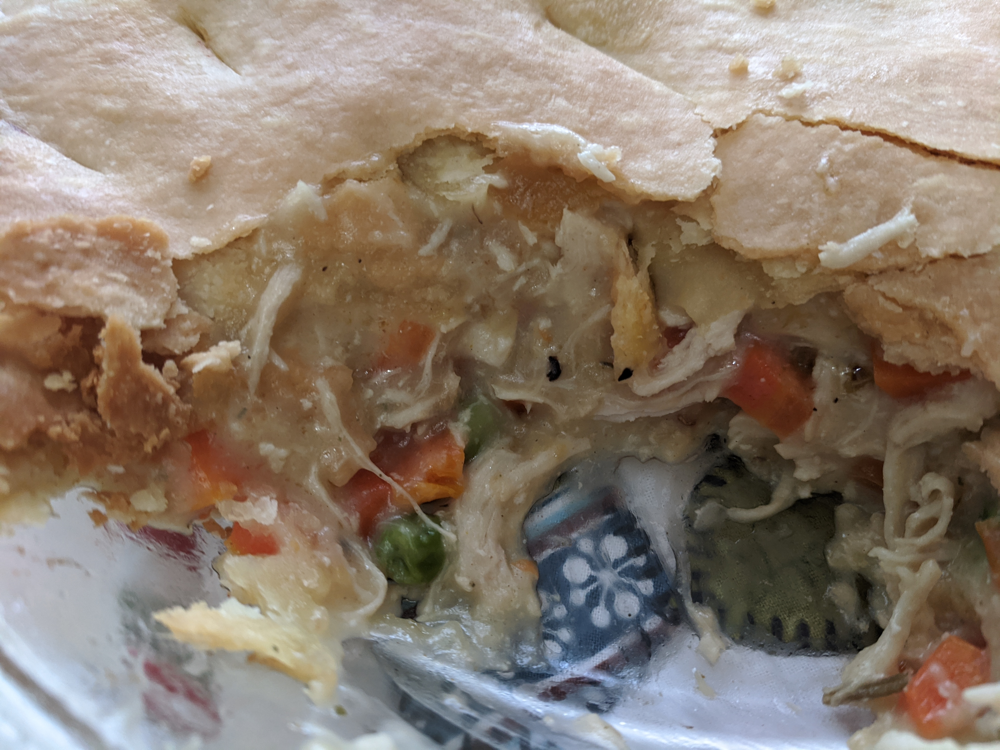
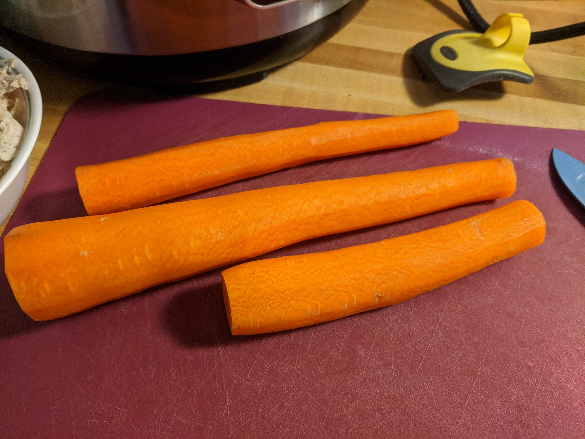
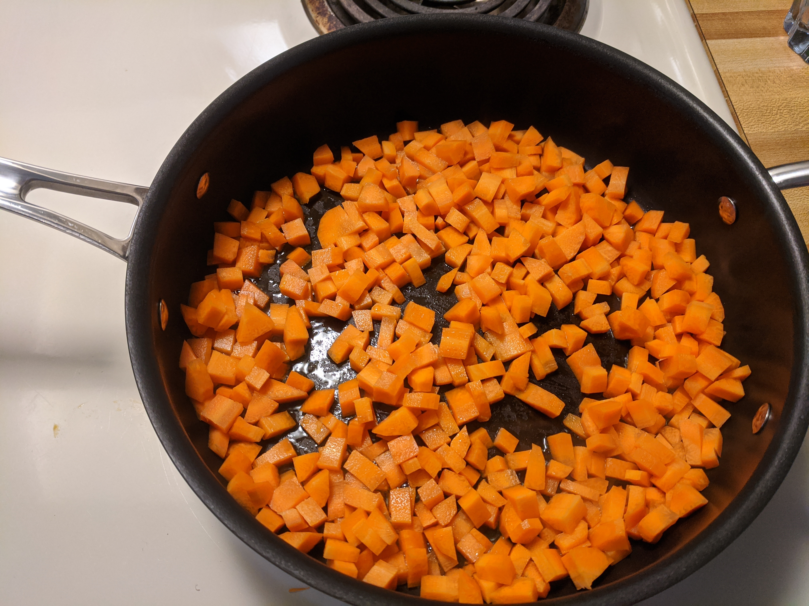
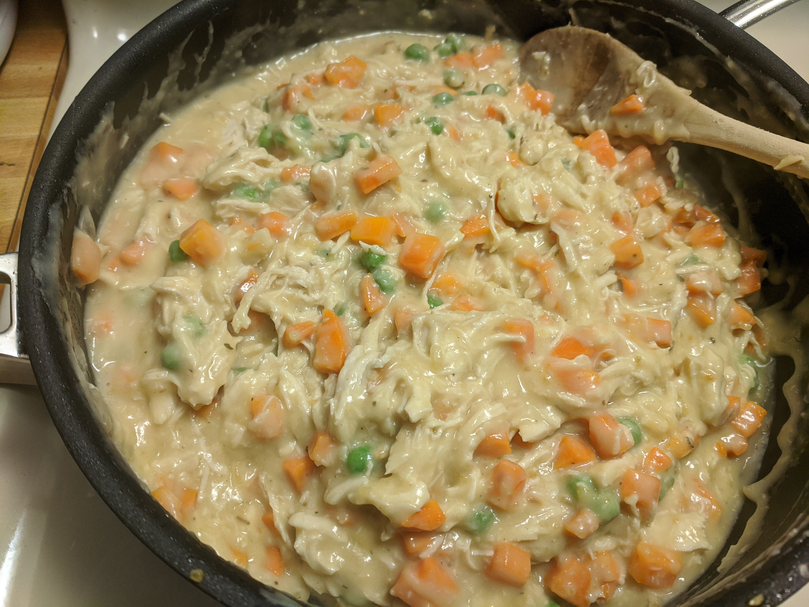
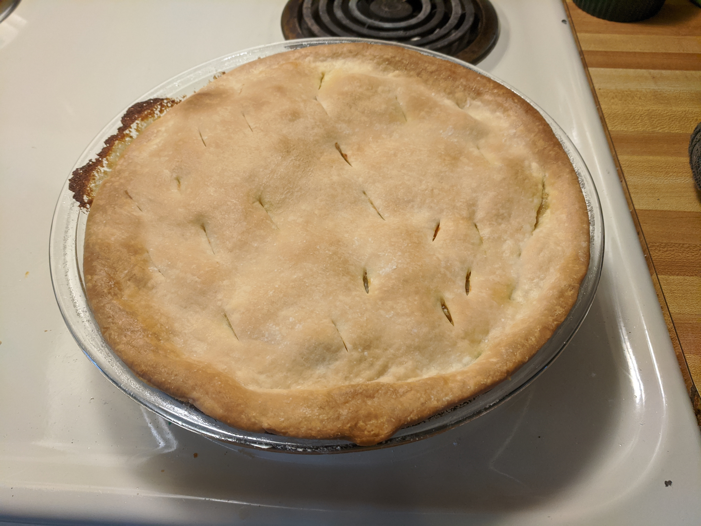

```{r setup, include=FALSE}
knitr::opts_chunk$set(echo = FALSE)
```

```{r show_baked_together}

```

## Ingredients

* 1 prepared pie crust, room temperature.
* 1 Tbsp oil
* 2 large carrots, chopped
* 1 Tbsp minced onion
* 1 tsp minced garlic
* 1/3 cup butter
* 1/3 cup flour
* 1 3/4 cup chicken stock
* 1/2 cup milk
* salt and pepper to taste
* 2 cups of shredded chicken breast
  * I like [this method](https://rmflight.github.io/recipes/posts/2021-11-06-poached-chicken-breast-instant-pot) of cooking chicken breast for this.
* 1/2 cup frozen peas

## Directions

* Dice **3 large** carrots.

```{r show_carrots}

```

```{r show_diced}

```

* Heat **1 Tbsp** oil in a skillet over medium-high heat.
* When oil is hot, add carrots, cook a couple of minutes.
* Add **1 Tbsp** minced onion and **1 tsp** garlic, cook for a couple of minutes more.
* Carrots should be browning on a side and starting to soften a bit.
* Remove carrots, garlic and onion from heat into another bowl.

* In the same saucepan, melt **1/3 cup** butter over medium heat.
* Add **1/3 cup** flour and mix into the butter, heating through.
* Add **1 3/4 cup** chicken stock and **1/2 cup** milk, stirring with a whisk.
* Continue heating and stirring until sauce begins to thicken.
* Add salt and pepper to taste.

* Lower heat a bit to keep sauce from burning, and add carrots/onion/garlic mix, **2 cups** shredded chicken, and **1/2 cup** peas. 

```{r show_shredded_chicken}
knitr::include_graphics("chicken_shredded.jpg")
```

* Mix to combine.

```{r show_mixed}

```

* Pour mixture into a greased pie pan.
* Cover with a prepared pie crust.
* Poke holes in the pie crust.
* Cover edges of pie crust with aluminum foil.

* Bake at 425 for 20 minutes.
* Remove aluminum foil from pie crust edges.
* Continue baking for another 10 - 20 minutes until crust is golden brown and mixture is heated through in the middle.

```{r show_pie}

```

* Allow to rest for 10 minutes before serving.


Adapted from [Pillsbury chicken pot pie](https://www.pillsbury.com/recipes/classic-chicken-pot-pie/1401d418-ac0b-4b50-ad09-c6f1243fb992)
